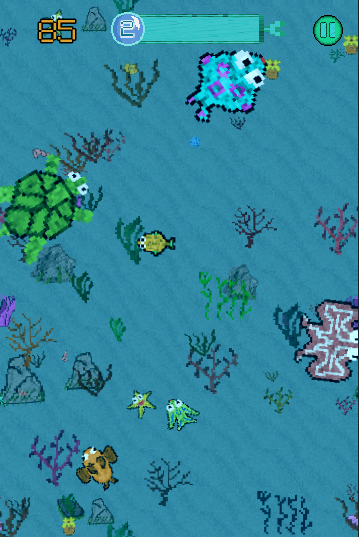
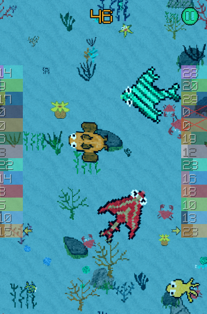

# FISHOLUTION

Fisholution is a simple 2D game which is made with [Godot Engine](https://godotengine.org). Whole point is eat small fishes and run away from big fishes.
There are two modes, *fisholution mode* and *natural selection mode*.

### Fisholution Mode: 

Don't be eaten and try to complete all fisholution stages. After every successfull fisholution your fish will evolve.

### Natural Selection Mode: 

Choose a fish between 13 different fishes and stay alive, eat other fishes and try to reach *score limit* first to win natural selection. Every fishes are enemy each other on this mode. Also there are other dangerous sea creatures, so stay away from them.  

**Good Luck !!!**

#LINKS

- [itch.io](https://avodhel.itch.io/fisholution)
- [Google Play](https://play.google.com/store/apps/details?id=com.NordicebearGames.Fisholution)

#CREDITS

- Some of musics and sounds made with [Bosca Ceoil](https://boscaceoil.net) by me and some of them made by different artists from [FreeSound](https://freesound.org).
- All of textures made with [Piskel App](https://www.piskelapp.com).
- Water shader created and coded by Gonkee. Check out his [Youtube Channel](https://www.youtube.com/channel/UCJqCPFHdbc6443G3Sz6VYDw/featured).

